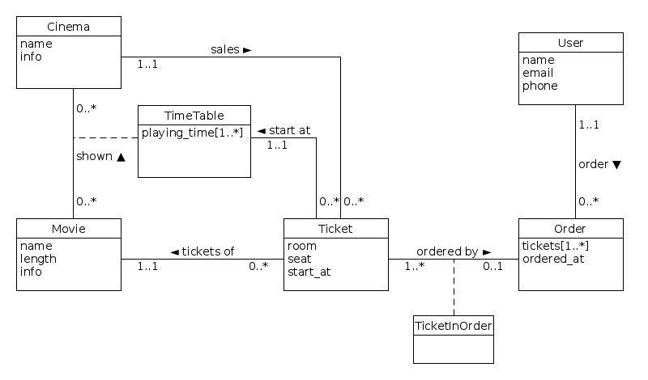
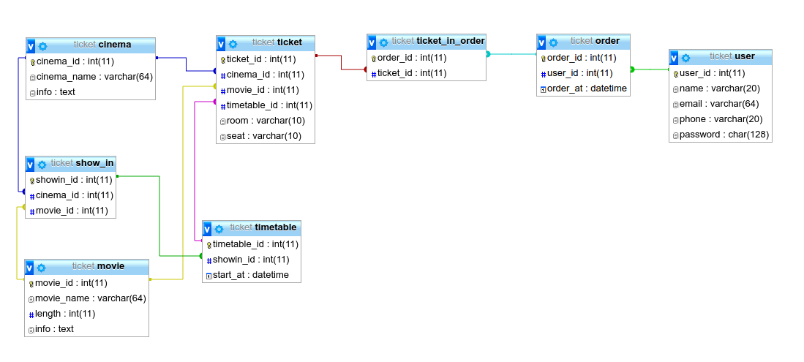

# Ticket Selling System

[](https://travis-ci.org/tommyleo2/ticket-selling-system)

## Database Design
### Database Class Diagram



### Database Schema



## RESTful API

### Sigin up
New user sign up

#### Method & URI
`POST /signup`

#### Data
Form data: 
`name`: string, user's name
`password`: string, user's password
`email`: string, user's email
`phone`: string, user's phone

#### Response
`200` on success
`403` on failed
```json
{
    "message": "invalid argument"
}

```
`409` on registered 
```json
{
    "message": "user registered"
}

```

---

### Sigin in
User sign in

#### Method & URI
`POST /signin`

#### Data
Form data: 
`name`: string, user's name
`password`: string, user's password

#### Response
`200` on success
`404` on failed
```json
{
    "message": "name or password incorrect"
}
```

---

### Sigin out
User sign out

#### Method & URI
`POST /signout`

#### Response
`200` on success

---

### Get cinema list
Get cinema list

#### Method & URI
`GET /cinema`

#### Response
`200` on success
##### list:
```json
[
    {
        "id": 1,
        "name": "Big Theatre"
    },
    ...
]
```

---

### Get cinema info
Get cinema info

#### Method & URI
`GET /cinema/{cinema id}/info`

#### Response
`200` on success
```json
{
    "info": "Really Big Theatre"
}
```
`404` on failed
```json
{
    "message": "unknown cinema"
}
```

---

### Get cinema movies
Get movies list shown in a cinema

#### Method & URI
`GET /cinema/{cinema id}/movies`


#### Response
`200` on success
```json
[
    {
        "id": 1,
        "name": "Movie A",
        "length": 95
    },
    {
        "id": 2,
        "name": "Movie B",
        "length": 95
    },
    ...
]
```
`404` on failed
```json
{
    "message": "unknown cinema"
}
```

---

### Get cinema movie show time
Get show time of a movie in a cinema

#### Method & URI
`GET /cinema/{cinema id}/movies/{movie_id}`


#### Response
`200` on success
```json
[
    "2017-05-25 17:00",
    "2017-05-26 17:00",
    ...
]
```
`404` on failed
```json
{
    "message": "unknown cinema"
}
```

---

### Get movie
Get all available movies

#### Method & URI
`GET /movie`


#### Response
`200` on success
```json
[
    {
        "id": 1,
        "name": "Movie A",
        "length": 95
    },
    {
        "id": 2,
        "name": "Movie B",
        "length": 95
    },
    ...
]
```

---

### Get movie info
Get movie info

#### Method & URI
`GET /movie/{movie id}/info`


#### Response
`200` on success
```json
{
    "info": "A Greate Movie"
}
```
`404` on failed
```json
{
    "message": "unknown movie"
}
```

---

### Get now playing of a cinema 
Get a list of cinima that is playing the movie

#### Method & URI
`GET /movie/{movie id}/cinemas`


#### Response
`200` on success
```json
[
    {
        "id": 1,
        "name": "Big Theatre"
    },
    ...
]
```
`404` on failed
```json
{
    "message": "unknown movie name"
}
```

---

### Show my tickets
Get a list of bought tickets

#### Method & URI
`GET /myticket`

cookie required


#### Response
`200` on success
```json
[
    {
        "id": 1,
        "movie_id": 1,
        "movie_name": "Greate movie",
        "cinema_id": 1,
        "cinema_name": "Greate Theatre",
        "start_at": "2017-06-01 18:00"
    },
]
```
`401` on failed
```json
{
    "message": "not logged in"
}
```

---

### Show available tickets
Get a list of available tickets of a movie in a cinema

#### Method & URI
`GET /ticket`

#### Data
Query:
`cinema`: string, cinema id
`movie`: string, movie id


#### Response
`200` on success
```json
[
    {
        "id": 1,
        "movie": "Movie A",
        "cinema": "Greate Theatre",
        "room": "2",
        "seat": "G10",
        "start_at": "2017-05-25 13:30",
        "length": 95
    },
]
```
`404` on failed
```json
{
    "message": "unknown cinema or movie"
}
```

---

### Buy tickets
Buy ticket

#### Method & URI
`POST /ticket/buy`

#### Data
Json:
```json
[
    1,
    2,
    3,
    ...
]
```
An array of ticket_id

Cookie needed
#### Response
`200` on success
`404` on non-existed tickets
```json
{
    "message": "tickets not exist",
    "tickets": [
        1,
        2,
        ...
    ]
}
```
`409` on ticket already been sold
```json
{
    "message": "tickets already been sold",
    "tickets": [
        1,
        2,
        ...
    ]
}
```
`401` not logged in
```json
{
    "message": "not logged in"
}
```

---
